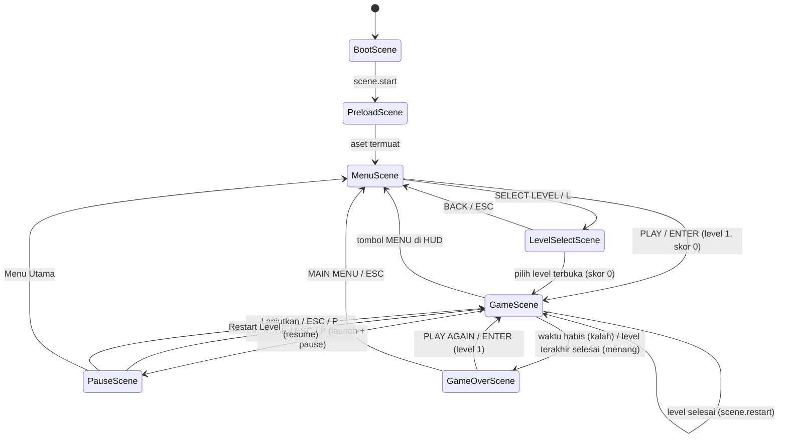
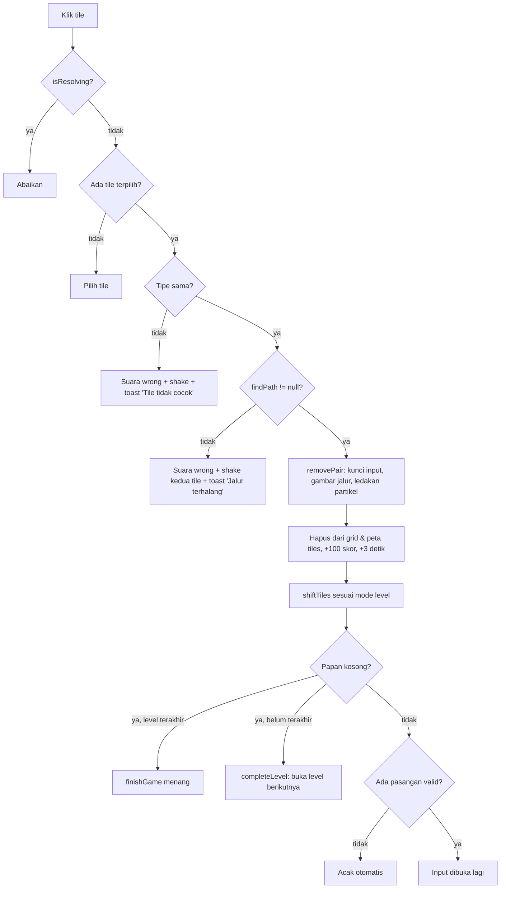

# Arsitektur Onet Classic

Dokumen ini menjelaskan desain teknis **Onet Classic** (Phaser 3 + Vite): struktur modul, siklus hidup Scene, algoritma pathfinding, logika pergeseran papan, dan sistem persistensi data.

> Semua nilai (ukuran grid, waktu, mode shift, dll.) dirujuk dari kode sumber. Bila kode berubah, perbarui dokumen ini bersamaan dengan perubahannya.

## Daftar Isi

1. [Gambaran Umum](#1-gambaran-umum)
2. [Struktur Proyek](#2-struktur-proyek)
3. [Konfigurasi Game & Skala Responsif](#3-konfigurasi-game--skala-responsif)
4. [Siklus Scene Phaser](#4-siklus-scene-phaser)
5. [Model Data Papan](#5-model-data-papan)
6. [Algoritma Pathfinding (BFS 2-Turn)](#6-algoritma-pathfinding-bfs-2-turn)
7. [Logika Papan (boardGenerator)](#7-logika-papan-boardgenerator)
8. [Alur Gameplay di GameScene](#8-alur-gameplay-di-gamescene)
9. [Sistem Persistensi](#9-sistem-persistensi)
10. [Audio](#10-audio)
11. [Manajemen Resource & Pembersihan Scene](#11-manajemen-resource--pembersihan-scene)
12. [Strategi Pengujian](#12-strategi-pengujian)
13. [Build & Deployment](#13-build--deployment)
14. [Panduan Memperluas Game](#14-panduan-memperluas-game)

---

## 1. Gambaran Umum

| Aspek            | Detail                                                        |
| ---------------- | ------------------------------------------------------------- |
| Engine           | Phaser `^3.90.0`                                              |
| Build tool       | Vite `^5.4.0` (ES Modules, `"type": "module"`)                |
| Bahasa           | JavaScript (ESM), tanpa TypeScript                            |
| Kanvas logis     | 1280 × 720, diskalakan dengan mode `FIT`                      |
| Penyimpanan      | `localStorage` (high score & progres level)                   |
| Backend          | Tidak ada. Game sepenuhnya berjalan di sisi klien (statis)    |
| Test             | Skrip Node murni (`node:assert`), tanpa browser & tanpa framework |

Prinsip desain utama:

- **Logika dipisah dari tampilan.** Aturan permainan (pathfinding, pembuatan papan, pergeseran, progres, layout) berada di `src/utils/` sebagai fungsi murni tanpa dependensi Phaser sehingga dapat diuji langsung di Node.
- **Scene hanya mengorkestrasi.** Scene memanggil fungsi util, lalu menerjemahkan hasilnya menjadi objek visual, tween, dan suara.
- **Konfigurasi terpusat.** Semua konstanta gameplay, level, warna, dan nama scene ada di `src/constants.js`.

## 2. Struktur Proyek

```text
onet-classic/
├── index.html                  # Entry HTML: container game, CSS reset sentuh, rotate-hint
├── vite.config.js              # base './', port 5173, chunk Phaser terpisah
├── package.json
├── scripts/
│   └── generate-audio-assets.mjs   # Generator WAV prosedural (SFX + BGM)
├── src/
│   ├── main.js                 # Konfigurasi Phaser.Game & daftar scene
│   ├── constants.js            # GAMEPLAY, LEVELS, SHIFT_MODES, SCENES, COLORS, dst.
│   ├── scenes/
│   │   ├── BootScene.js
│   │   ├── PreloadScene.js
│   │   ├── MenuScene.js
│   │   ├── LevelSelectScene.js
│   │   ├── GameScene.js
│   │   ├── PauseScene.js       # Modal overlay di atas GameScene
│   │   └── GameOverScene.js    # Dipakai untuk kalah DAN menang
│   ├── components/
│   │   ├── Tile.js             # Container tile (sprite + bingkai bertekstur)
│   │   └── UIOverlay.js        # HUD: timer, skor, level, tombol, toast
│   ├── utils/                  # Logika murni & helper (lihat tabel di bawah)
│   └── assets/
│       ├── animal-tiles.svg    # Spritesheet tile (frame 96×96)
│       └── audio/*.wav         # bgm, tile-click, match, wrong, hint, shuffle, clock-tick
└── tests/                      # 8 berkas *.test.mjs
```

### Peran modul `src/utils/`

| Modul                | Peran                                                                 | Bebas Phaser? |
| -------------------- | --------------------------------------------------------------------- | :-----------: |
| `pathfinding.js`     | `findPath`, `findValidPair` (BFS maks. 2 belokan)                     | Ya |
| `boardGenerator.js`  | `generateBoard`, `shuffleRemaining`, `applyShift`, `countTiles`        | Ya |
| `highScore.js`       | Baca/simpan rekor skor ke `localStorage`                              | Ya |
| `levelProgress.js`   | Progres level terbuka + cadangan memori                               | Ya |
| `levelGrid.js`       | Hitung posisi kartu di layar Level Select                             | Ya |
| `boardLayout.js`     | Hitung ukuran tile & posisi papan agar muat di layar                  | Ya |
| `sceneCleanup.js`    | Kantong listener & pembersihan siklus hidup scene                     | Ya |
| `audioSettings.js`   | Status mute BGM/SFX di `game.registry`                                | Tidak (menerima objek scene) |
| `transitions.js`     | `fadeToScene` (fade out lalu pindah scene, aman dari klik ganda)      | Tidak (menerima objek scene) |
| `createButton.js`    | Tombol dengan umpan balik hover/press dan area sentuh diperlebar      | Tidak |
| `uiLayout.js`        | Posisi & ukuran tombol (HUD, menu, pause, dll.)                       | Ya |
| `background.js`      | Latar bertema untuk Menu/LevelSelect/GameOver                         | Tidak |
| `orientationHint.js` | Imbauan memutar ke landscape di layar potret sempit                   | Tidak (DOM) |
| `device.js`          | Deteksi sentuh/mobile                                                 | Tidak |

## 3. Konfigurasi Game & Skala Responsif

Didefinisikan di `src/main.js`:

- `type: Phaser.AUTO` (WebGL, fallback Canvas).
- Kanvas logis tetap **1280 × 720** (`GAME_WIDTH`, `GAME_HEIGHT`). Semua koordinat di kode memakai satuan logis ini.
- `scale.mode = Phaser.Scale.FIT` dengan `autoCenter: CENTER_BOTH` dan `autoRound: true` (menghindari ukuran piksel pecahan yang membuat teks buram). Kanvas mengisi `#game-container`, yang memenuhi viewport (`100dvh`, dengan `env(safe-area-inset-*)` untuk notch).
- `disableContextMenu: true` dan `input.touch.capture: true` agar sentuhan sepenuhnya dikuasai game (tanpa scroll/zoom bawaan browser; didukung juga oleh `touch-action: none` di `index.html`).
- Area sentuh minimum `TOUCH.minTarget = 84` satuan game (≈ 45 px layar pada HP landscape), dipakai `createButton` untuk memperluas hit area.
- `installOrientationHint()` memasang overlay DOM bila perangkat potret dengan lebar ≤ 900 px; pemain dapat menutupnya lewat tombol "Tetap main".
- Hanya di mode dev, instance game diekspos sebagai `window.__ONET_GAME__`. Saat HMR Vite, instance lama dibuang (`game.destroy(true)`) agar tidak menumpuk.

Ukuran tile dihitung dinamis oleh `computeBoardLayout(rows, cols)`: ukuran = `min(TILE_SIZE=64, floor(tinggiArea / rows), floor(lebarArea / cols))` (minimal 16), lalu papan dipusatkan di `BOARD_AREA`. Dengan begitu papan besar (mis. 10 × 16) tetap muat.

## 4. Siklus Scene Phaser

Urutan scene didaftarkan di `main.js`: `Boot → Preload → Menu → LevelSelect → Game → Pause → GameOver`. Nama scene dipusatkan di `SCENES` (`constants.js`).



> `PauseScene` tidak ada dalam daftar enam scene utama, tetapi merupakan scene ketujuh di kode: ia berjalan sebagai **overlay** di atas `GameScene`.

### 4.1 BootScene

- Menghasilkan tekstur placeholder secara prosedural: `logo` (kotak bulat 128×128) dan `bar-bg` (bingkai progress bar 500×32) lewat `Graphics.generateTexture`.
- Tidak memuat file eksternal. Setelah selesai, langsung `scene.start(PRELOAD)`.

### 4.2 PreloadScene

- Memuat spritesheet `animal-tiles` (frame 96×96) dan tujuh audio: `bgm`, `tile-click`, `match`, `wrong`, `hint`, `shuffle`, `clock-tick`.
- URL aset diimpor sebagai modul (`import url from '../assets/...'`) agar di-hash oleh Vite saat build.
- Setelah itu langsung `scene.start(MENU)`.

### 4.3 MenuScene

- Menampilkan judul beranimasi, tombol **PLAY** (`startGame` → `GameScene` dengan `{ level: 1, score: 0 }`) dan **SELECT LEVEL**.
- Menampilkan `High Score` (`getHighScore()`) dan `Level terbuka: n / MAX_LEVEL` (`getUnlockedLevel()`).
- Pintasan keyboard: `ENTER` (main), `L` (pilih level). Teks bantuan menyesuaikan perangkat sentuh/desktop.

### 4.4 LevelSelectScene

- Menggambar kartu untuk setiap entri `LEVELS` memakai `computeLevelGrid` (maks. 5 kolom, baris terakhir dipusatkan).
- Tiga status kartu, ditentukan dari `getUnlockedLevel()`:
  - **Terkunci** (`level > unlocked`): abu-abu, ikon gembok; klik hanya memberi umpan balik (goyang + toast).
  - **Terbuka & sudah selesai** (`level < unlocked`): dapat dimainkan, ada tanda centang.
  - **Terbuka tertinggi** (`level === unlocked`): bingkai emas berdenyut.
- Memilih level memanggil `fadeToScene(GAME, { level, score: 0 })`. `ESC`/BACK kembali ke menu.

### 4.5 GameScene

Scene inti. Menerima `{ level, score }`; `level` di-clamp ke `1..MAX_LEVEL`.

Urutan `create()`:

1. Pasang `setupSceneCleanup` (pembersihan otomatis saat shutdown/destroy).
2. Baca konfigurasi level (`getLevelConfig`) dan hitung layout (`computeBoardLayout`).
3. Inisialisasi state: `score`, `levelStartScore`, `timeLeft = timeLimit`, `shufflesLeft = GAMEPLAY.shuffles (3)`, `selectedTile`, peta `tiles`.
4. `generateBoard(rows, cols, tileTypes)` untuk membuat `grid`.
5. Mulai BGM (`startBackgroundMusic`), buat efek (`createMatchEffects`), buat tile (`createTiles`), dan HUD (`UIOverlay`).
6. Pasang pintasan `ESC`/`P` dan sinkronisasi audio saat `RESUME`.
7. Jika papan awal tidak punya pasangan valid → `shuffleBoard(true)` (otomatis).
8. Tampilkan banner level (plus label mode shift bila ada).

`update(_, delta)`: selama `isResolving` bernilai `false`, mengurangi `timeLeft`, memperbarui timer bar, memutar `clock-tick` tiap detik saat sisa waktu < 10 detik, dan memanggil `finishGame(false)` saat waktu habis.

Transisi antar level memakai `scene.restart({ level, score })` dengan flag `keepMusic = true` sehingga BGM tidak terputus.

### 4.6 PauseScene (overlay)

- `GameScene.pauseGame()` memanggil `scene.launch(PAUSE)` lalu `scene.pause()`. Update, timer, tween, dan input `GameScene` otomatis berhenti, sehingga waktu tidak berkurang saat pause.
- Latar gelap pekat (alpha 0.98) bersifat interaktif untuk mencegah klik tembus dan "mengintip" papan.
- Aksi: **Lanjutkan** (`scene.resume` + `scene.stop`), **Restart Level** (memanggil `GameScene.restartLevel()`; skor kembali ke nilai awal level), **Menu Utama** (`scene.stop(GAME)` lalu `scene.start(MENU)`), serta toggle MUSIK/SFX.
- Pause diabaikan bila `transitioning`, `levelCompleteShown`, atau scene sudah dalam keadaan pause.

### 4.7 GameOverScene

Menerima `{ win, score, level, timeLeft }`.

- Menyimpan skor via `saveHighScore(score)` pada **kalah maupun menang**.
- Menampilkan skor akhir (count-up), indikator rekor, statistik (level, pasangan = `floor(score / pairScore)`, sisa waktu), serta tombol **PLAY AGAIN** (level 1, skor 0) dan **MAIN MENU**.
- Rekor baru memicu teks animasi **NEW HIGH SCORE!** dan confetti (partikel dibuang setelah selesai).
- `playAgain` selalu mengirim data eksplisit `{ level: 1, score: 0 }`, sebab Phaser dapat memakai ulang data `start` sebelumnya bila tidak diberi data baru.

### 4.8 Transisi

`fadeToScene(scene, key, data, duration)` melakukan fade out kamera, lalu `scene.start`. Flag `scene.isLeaving` mencegah transisi ganda (klik ganda atau tombol + pintasan keyboard) dan di-reset saat `shutdown` karena instance scene dipakai ulang oleh Phaser.

## 5. Model Data Papan

Papan direpresentasikan sebagai matriks 2D `grid[r][c]`:

- `0` = sel kosong, `> 0` = tipe tile (`1..tileTypes`).
- Papan **dibungkus border kosong** selebar 1 sel. Untuk level `rows × cols`, ukuran grid sebenarnya `(rows + 2) × (cols + 2)` dan tile berada di indeks `1..rows` / `1..cols`.
- Border memungkinkan jalur penghubung melintas **di luar** papan, sebagaimana aturan Onet klasik.
- Tiap tipe tile berjumlah **genap**; `rows × cols` wajib genap (jika tidak, `generateBoard` melempar error).
- `GameScene.tiles` adalah `Map` dengan kunci `"r,c"` → objek `Tile`. Peta ini harus selalu sinkron dengan `grid`.

Konfigurasi level saat ini (`LEVELS`):

| Level | Grid    | Waktu | Jenis tile | Mode shift |
| :---: | ------- | :---: | :--------: | ---------- |
| 1     | 6 × 10  | 120 s | 12         | `none`     |
| 2     | 8 × 12  | 110 s | 16         | `none`     |
| 3     | 8 × 14  | 100 s | 20         | `down`     |
| 4     | 10 × 14 | 90 s  | 24         | `left`     |
| 5     | 10 × 16 | 80 s  | 24         | `center`   |

## 6. Algoritma Pathfinding (BFS 2-Turn)

Berkas: `src/utils/pathfinding.js`.

### 6.1 Aturan

Dua tile bertipe sama dapat dihubungkan bila ada jalur yang hanya melewati sel kosong dengan **maksimal 2 belokan** (maksimal 3 segmen lurus). Titik awal dan tujuan adalah sel tile itu sendiri.

### 6.2 Pendekatan: BFS per lapisan belokan

State pencarian adalah **(baris, kolom, arah)** dengan 4 arah (atas, kanan, bawah, kiri). Nilai belokan minimum tiap state disimpan di `best[]` (`Int16Array` berukuran `rows × cols × 4`).

```text
levels[0] = semua state awal (posisi tile A, keempat arah), belokan = 0
untuk t = 0 .. maxTurns:
    untuk setiap node di levels[t]:
        1) LURUS  : maju satu sel searah node.
                    - jika sel itu tile tujuan B  -> jalur ditemukan
                    - jika sel kosong & belum lebih baik -> masukkan ke levels[t] (belokan tetap t)
        2) BELOK  : jika t < maxTurns, ganti arah ±90°
                    -> masukkan ke levels[t+1] (belokan bertambah 1)
kembalikan null bila semua lapisan habis
```

Karakteristik penting:

- Gerak lurus **tidak** menambah belokan; hanya perubahan arah yang menambahnya.
- Lapisan `t = 0` diproses penuh sebelum `t = 1`, dan seterusnya. Dengan demikian jalur pertama yang ditemukan adalah jalur dengan **belokan paling sedikit** (0-turn lebih dulu daripada 1-turn, lalu 2-turn).
- Tile tujuan B boleh "ditabrak" (satu-satunya sel non-kosong yang boleh dimasuki); semua tile lain menghalangi jalur.
- Sel yang sudah dikunjungi dengan arah dan jumlah belokan yang sama atau lebih baik tidak diproses ulang (`best[idx] > t`).

### 6.3 Validasi masukan

`findPath(grid, a, b, maxTurns = 2)` mengembalikan `null` bila: grid/titik tidak ada, titik A sama dengan B, titik di luar grid, sel A kosong, atau tipe A ≠ tipe B.

### 6.4 Keluaran

Larik titik sudut `{ r, c }` berisi: titik awal, setiap titik belokan, dan titik akhir. `buildPath` menelusuri pointer `prev` ke belakang, membuang duplikat berurutan, dan membuang titik yang segaris sehingga hanya sudut yang tersisa. Larik ini langsung dipakai `showMatchPath` untuk menggambar garis neon (tiga lapis `Graphics` yang dipakai ulang).

### 6.5 `findValidPair`

Mengelompokkan tile per tipe, lalu menguji semua kombinasi pasangan dalam tipe yang sama dengan `findPath`. Mengembalikan pasangan pertama yang valid `{ a, b, path }` atau `null`. Dipakai oleh:

- **Hint** (`showHint`): membuat dua tile berkedip.
- **Deteksi buntu**: setelah papan dibuat, setelah pergeseran, dan setelah shuffle. Bila `null`, papan diacak otomatis.
- **Shuffle**: memverifikasi hasil acak.

### 6.6 Kompleksitas

Jumlah state dibatasi `rows × cols × 4` per lapisan belokan, jadi satu `findPath` bersifat linear terhadap ukuran grid (sangat ringan untuk grid terbesar 12 × 18 termasuk border). `findValidPair` pada kasus terburuk menguji O(n²) pasangan per tipe, yang tetap kecil untuk ukuran papan game ini.

## 7. Logika Papan (boardGenerator)

Berkas: `src/utils/boardGenerator.js`. Semua fungsi menerima `rng` opsional (default `Math.random`) agar dapat diuji secara deterministik.

### 7.1 `generateBoard(rows, cols, typeCount, border = 1, rng)`

1. Hitung `pairs = rows × cols / 2` dan `types = min(typeCount, pairs)`.
2. Bagikan pasangan ke tiap tipe **secara bergantian** (`p % types + 1`), sehingga setiap tipe pasti berjumlah genap.
3. Kocok daftar tile dengan Fisher-Yates (`shuffle`).
4. Tempatkan ke grid ber-border kosong.

### 7.2 `shuffleRemaining(grid, rng, attempts = 100)`

Mengacak tile yang tersisa **in-place**: posisi sel terisi tetap, hanya nilainya yang dipertukarkan, sehingga jumlah/jenis tile dan border kosong tidak berubah.

1. Coba acak biasa hingga `attempts` kali; berhenti begitu `findValidPair` menemukan pasangan.
2. Bila semua gagal, `forcePair` memaksa satu pasangan sejenis ditempatkan di dua sel yang memang terhubung. Keterhubungan hanya bergantung pada sel kosong, bukan jenis tile, sehingga pengujian dilakukan pada grid probe "semua tile = 1".
3. Mengembalikan `true` bila setelah pengacakan ada pasangan valid.

Setelah `grid` diacak, `GameScene.shuffleBoard` menyinkronkan tampilan dengan `tile.setValue(grid[r][c])`. Shuffle manual dibatasi 3× per level (`shufflesLeft`); shuffle **otomatis** tidak memakai jatah.

### 7.3 `applyShift(grid, mode, border = 1)` — mekanik pergeseran

Dipanggil setelah sepasang tile dihapus. Mengubah `grid` **in-place**, hanya pada area isi (di dalam border), dan mengembalikan daftar `{ from, to, value }` untuk tile yang benar-benar berpindah (kosong bila mode `none`).

Intinya adalah fungsi `settle(slots, offsetFor)` yang memampatkan satu garis (kolom atau baris):

1. Ambil tile non-kosong pada garis tersebut **menurut urutan aslinya**.
2. Hitung `offset` (indeks slot pertama yang dipakai) dari jumlah tile `n` dan panjang garis `total`.
3. Kosongkan garis, tempatkan ulang tile berurutan mulai dari `offset`, catat perpindahan.

| Mode     | Garis yang diproses | Rumus `offset`           | Efek                           |
| -------- | ------------------- | ------------------------ | ------------------------------ |
| `none`   | -                   | -                        | Tidak ada pergeseran (klasik)  |
| `down`   | tiap kolom          | `total - n`              | Gravitasi ke bawah             |
| `left`   | tiap baris          | `0`                      | Rapat ke kiri                  |
| `right`  | tiap baris          | `total - n`              | Rapat ke kanan                 |
| `center` | tiap baris          | `floor((total - n) / 2)` | Rapat ke tengah (horizontal)   |

Mode di luar daftar melempar `Error('Mode shift tidak dikenal: ...')`.

**Jaminan**: urutan relatif tile dalam satu garis selalu terjaga, jadi tile tidak pernah saling melewati dan aman dianimasikan dengan tween.

**Animasi** (`GameScene.shiftTiles`):

1. Panggil `applyShift` untuk memperbarui `grid` dan mendapat daftar `moves`. Bila kosong, langsung lanjut.
2. Ambil semua objek `Tile` dari peta `tiles` **sebelum** peta diubah (kunci lama dan baru dapat bertabrakan), hapus kunci lama, lalu daftarkan ke kunci baru.
3. Jalankan `tile.moveTo(...)` dengan durasi `clamp(140 + jarak × 60, 160, 420)` ms; easing `Bounce.easeOut` untuk mode `down`, `Cubic.easeInOut` untuk lainnya.
4. Penghitung `pending` memanggil callback `onDone` setelah **semua** tween selesai. Selama itu `isResolving = true` sehingga input terkunci.
5. Setelah selesai: bila papan kosong → menang/level selesai; bila tidak ada pasangan valid → acak otomatis.

## 8. Alur Gameplay di GameScene



Parameter gameplay (`GAMEPLAY` di `constants.js`): `pairScore = 100`, `timeBonus = 3` detik (dibatasi `timeLimit` level), `shuffles = 3`.

Flag status yang perlu dipahami:

| Flag                 | Fungsi                                                                          |
| -------------------- | ------------------------------------------------------------------------------- |
| `isResolving`        | Mengunci input & menghentikan timer selama animasi, modal, atau transisi        |
| `transitioning`      | Mencegah transisi level ganda                                                   |
| `levelCompleteShown` | Mencegah pause saat modal level selesai tampil                                  |
| `keepMusic`          | BGM tidak dibuang saat scene di-restart antar level                             |

## 9. Sistem Persistensi

Seluruh persistensi memakai `localStorage` melalui helper terisolasi. Setiap akses dibungkus `try/catch` karena storage dapat diblokir (mode privat, kebijakan browser) atau datanya rusak.

| Data                 | Key `localStorage`     | Modul              | Perilaku                                                                                   |
| -------------------- | ---------------------- | ------------------ | ------------------------------------------------------------------------------------------ |
| Skor tertinggi       | `onet_high_score`      | `highScore.js`     | Hanya ditulis bila skor baru **>** rekor lama; data tidak valid dibaca sebagai `0`         |
| Level terbuka        | `onet_unlocked_level`  | `levelProgress.js` | Hanya naik (tidak pernah turun), dibatasi `MAX_LEVEL`; data tidak valid dibaca sebagai `1` |
| Status mute BGM/SFX  | *(tidak disimpan)*     | `audioSettings.js` | Disimpan di `game.registry` (memori); hilang saat halaman dimuat ulang                      |

### 9.1 High Score

- `getHighScore()` → bilangan bulat ≥ 0; `0` bila belum ada, rusak, atau storage tidak tersedia.
- `saveHighScore(score)` → `{ highScore, previous, isNew }`. Skor dinormalisasi dengan `Math.floor(Number(score) || 0)`. Bila gagal menulis, hasil tetap dianggap rekor untuk sesi berjalan, tetapi tidak persisten.
- Dipanggil di `GameOverScene.create()` untuk hasil kalah **dan** menang. Dibaca di `MenuScene` dan `GameOverScene`.

### 9.2 Progres Level

- `getUnlockedLevel()` → `1..MAX_LEVEL`. Level 1 selalu terbuka.
- `completeLevelProgress(level)` dipanggil di `GameScene.completeLevel()` dan membuka `level + 1`.
- **Cadangan memori**: bila `localStorage` tidak dapat dipakai, variabel modul `memoryUnlocked` menyimpan progres selama sesi berjalan agar level baru tetap dapat dipilih. `resetMemoryFallback()` tersedia khusus untuk tes.

> Catatan: karena data berada di sisi klien, nilai di `localStorage` dapat diubah pemain sendiri. Sistem ini dirancang untuk pengalaman lokal, bukan untuk kompetisi yang menuntut integritas data. Lihat [ROADMAP.md](ROADMAP.md) untuk rencana leaderboard online.

## 10. Audio

- **Aset**: tujuh berkas WAV di `src/assets/audio/`, dibuat secara prosedural oleh `scripts/generate-audio-assets.mjs` (sample rate 22050 Hz, mono, 16-bit). Jalankan ulang dengan `node scripts/generate-audio-assets.mjs`.
- **BGM**: dibuat sekali (`loop: true`, volume 0.22) lalu dipakai ulang antar level lewat `getBgm()` yang menyaring sound yang sudah `pendingRemove`.
- **SFX**: `playSfx(key, volume)` memeriksa mute SFX dan keberadaan kunci di `cache.audio` sebelum memutar.
- **Kebijakan autoplay browser**: bila `this.sound.locked`, pemutaran BGM ditunda sampai event `unlocked` (setelah interaksi pertama pemain). Lihat [TROUBLESHOOTING.md](TROUBLESHOOTING.md#2-audio-tidak-berbunyi-kebijakan-autoplay-browser).
- **Mute**: toggle MUSIK dan SFX terpisah, tersedia di HUD dan modal pause, disimpan di `game.registry` sehingga berlaku lintas scene.

## 11. Manajemen Resource & Pembersihan Scene

Phaser membersihkan display list, tween, input, dan kamera saat shutdown, tetapi **tidak** membersihkan listener pada emitter berumur panjang (`scene.events`, `scene.sound`, `registry`, `scale`) maupun referensi di field instance. Karena instance scene dipakai ulang, listener yang tidak dilepas akan menumpuk di setiap kunjungan.

`setupSceneCleanup(scene, onCleanup)` (di `src/utils/sceneCleanup.js`) menyelesaikannya:

1. Mengembalikan **listener bag** dengan `on`/`once` yang mencatat setiap listener.
2. Pada event `shutdown` **atau** `destroy` (dijalankan tepat sekali), bag melepas semua listener, menjalankan callback pembersihan khusus scene (`releaseResources` di `GameScene`: hancurkan HUD, tile, partikel, lapisan jalur, null-kan referensi), lalu `releaseSceneResources` sebagai jaring pengaman.

Aturan praktis: **setiap listener pada emitter di luar scene harus didaftarkan lewat `cleanup.on/once`**.

Optimasi performa yang diterapkan:

- Bingkai tile digambar **sekali** ke tekstur (per status & ukuran) dan dipakai sebagai `Image` (ikut batching sprite), bukan objek `Graphics` per tile.
- Tiga lapis garis jalur dibuat sekali dan dipakai ulang tiap pasangan.
- `UIOverlay.setTime()` men-cache nilai terakhir agar tidak menggambar ulang bila tidak berubah.
- Dekorasi dikurangi di perangkat mobile (`isMobileDevice`).

## 12. Strategi Pengujian

Pengujian berupa skrip Node murni (`node:assert/strict`) untuk logika tanpa Phaser/browser. `npm test` menjalankan semuanya berurutan:

| Berkas                       | Cakupan                                          |
| ---------------------------- | ------------------------------------------------ |
| `tests/logic.test.mjs`       | `generateBoard`, `findValidPair`, `shuffleRemaining` (termasuk jalur fallback `forcePair`) dengan RNG deterministik |
| `tests/levels.test.mjs`      | Konsistensi `LEVELS`: jumlah tile genap, waktu menurun, grid membesar, `getLevelConfig` ter-clamp, papan muat di layar |
| `tests/shift.test.mjs`       | `applyShift` untuk `down`/`left`/`right`/`center`/`none` dan error pada mode tak dikenal |
| `tests/highscore.test.mjs`   | Simpan/baca high score, dengan dan tanpa `localStorage` |
| `tests/levelprogress.test.mjs` | Progres level, cadangan memori, batas `MAX_LEVEL`  |
| `tests/levelgrid.test.mjs`   | Layout kartu Level Select (muat di area, tanpa tumpang tindih) |
| `tests/layout.test.mjs`      | Area sentuh tombol UI: tidak tumpang tindih, di dalam layar, tidak menutupi papan |
| `tests/cleanup.test.mjs`     | Listener bag & `setupSceneCleanup` (tidak ada listener menumpuk setelah banyak siklus) |

Logika yang menyentuh Phaser (tampilan, tween, input) saat ini diverifikasi secara manual di browser.

## 13. Build & Deployment

- `npm run build` menghasilkan folder `dist/`. `base: './'` di `vite.config.js` membuat path aset relatif sehingga hasil build dapat dihosting di subfolder (itch.io, GitHub Pages, dll.).
- Phaser dipisah ke chunk tersendiri (`manualChunks`) agar kode game kecil dan cache-friendly; batas peringatan ukuran chunk dinaikkan ke 1500 kB karena Phaser memang besar.
- Berkas hasil build memakai nama ber-hash, sehingga pembaruan versi otomatis menghindari cache lama (lihat [TROUBLESHOOTING.md](TROUBLESHOOTING.md#3-perubahan-tidak-muncul--isu-cache-browser)).
- `npm run preview` menyajikan hasil build secara lokal untuk verifikasi.

## 14. Panduan Memperluas Game

### Menambah level

1. Tambahkan entri di `LEVELS` (`src/constants.js`): `{ rows, cols, timeLimit, tileTypes, shift }`.
2. Pastikan `rows × cols` **genap**.
3. `MAX_LEVEL`, layar Level Select, progres, dan layout papan menyesuaikan otomatis.
4. Jalankan `npm test` (khususnya `levels.test.mjs`, `levelgrid.test.mjs`, `layout.test.mjs`).

### Menambah mode pergeseran

1. Tambahkan nilai di `SHIFT_MODES` dan label di `SHIFT_LABELS`.
2. Tambahkan `case` baru di `applyShift` (`boardGenerator.js`) dengan menjaga urutan relatif tile.
3. Tambahkan pengujian di `tests/shift.test.mjs`.

### Menambah jenis tile

Spritesheet `animal-tiles` memiliki 24 frame; `Tile.frameFor(value)` memakai `(value - 1) % 24`. Untuk lebih dari 24 jenis, tambahkan frame di spritesheet dan sesuaikan angka modulo tersebut.
